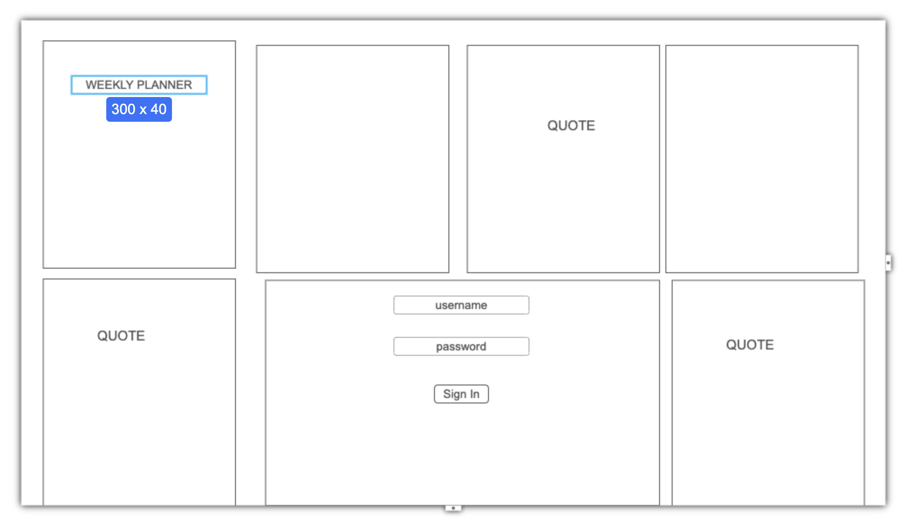
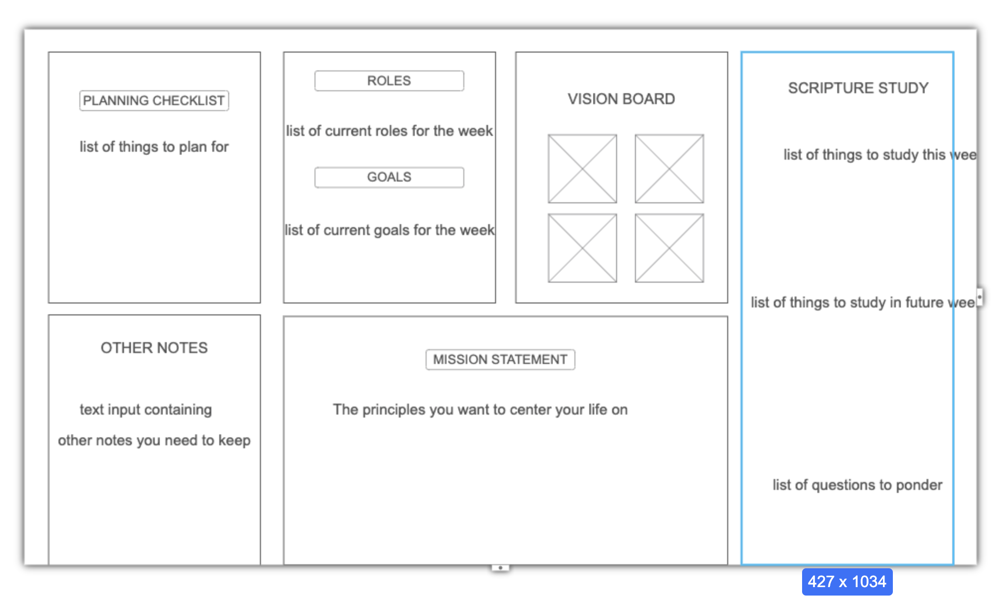

# Weekly Planner: CS 260 Project

  <a href="notes.md"><strong>My Notes</strong></a> ·
  <a href="#specification-deliverable"><strong>Specification Deliverable</strong></a> ·
  <a href="#html-deliverable"><strong>HTML Deliverable</strong></a> · 

 

## Specification Deliverable

#### Elevator Pitch

What is the hardest thing about organizing your life? Its keeping your plans, goals, and vision organized in one place. It's never convenient/effective keeping track of separate notebooks, calendars, and folders, and if youre trying to do it digitally then you have to make your plans using multiple applications. This Weekly Planning app brings everything together in one place that allows you to collaborate on your plans with others, using a chat feature and interactive components to help you keep track of your vision.

#### Design

    

        
        <label for="loginPage">Login Page</label>
    

    

        
        <label for="planningPage">Planning Page</label>
    

#### Key features

- Display of and ability to edit lists for the following categories
    - Checklist Items: Things you need to plan for
    - Roles you'll take on this week
    - Goals you have for this week
    - Long term Vision Board goals
    - A Scripture Study list of topics
- Edit a notepad that saves automatically
- Chat with others to coordinate your plans
- Changes are persistently stored
- Secure login over HTTPS

#### Technologies

***HTML*** - Main landing page with motivating quotes, authentication page for signin, signup, and main planning dashboard for authenticated user. HTML elements include dynamic lists where users can see goals, personal roles, and checklist Items for various different categories in their weekly planning.

***CSS*** - CSS modules for landing and login pages to demonstrate CSS proficiency. Dr Clement approved me to use Tailwind CSS classes to style the rest of the project for efficiency.

***JavaScript*** - Login. Adding and deleting elements from various lists (listed in key features above). Saving notes on the notepad.

***React*** - Single page application with main page view, login view, planning board view. List component for displaying db info, and chat component both accessivle from the planning board. App context will save data so that users can navigate between the pages without loosing progress

***Service*** - Endpoints for the following functions:
    - start new chat
    - send message
    - get messages
    - typing status

***DB/Login*** - Using auth (users table), db Tables (goals and plans for planning board), and chat history.

***WebSocket*** - Chat feature where you can plan with other users real time. Keeps planning info in one place, rather than having to look through texts.

## HTML deliverable

This deliverable includes the three page structure of my application using HTML.

- [x] **HTML pages** - Three HTML pages that represent a login page, a planningBoard page where users will record their plans, and a chat page where users can collaborate.
- [x] **Links** - Each page includes a navigation bar that links to each page.
- [x] **Text** - Lists of user data is displayed, as well as Headers for each section and chat messages in the chatbox.
- [x] **Images** - A user profile image is placed on the planningBoard page. A background image is provided on each page (below the footer so it doesn't take up a ton of space).
- [x] **DB/Login** - Input box and submit button for login. Input for all the different types of user data on the planningboard page. Input for chat messages. Message history and planning list information will be pulled from the database.
- [x] **WebSocket** - Chat feature for collaborating with other users represents real time chat over websocket.

## CSS deliverable

For this deliverable I properly styled the application into its final appearance.

- [x] **Header, footer, and main content body**
- [x] **Navigation elements** - I colored the navigation links and made them appear to be buttons. Aligned them in a flex-box to display at the top of the page.
- [x] **Responsive to window resizing** - My app looks great on all window sizes and devices
- [x] **Application elements** - Used good contrast and whitespace
- [x] **Application text content** - Consistent fonts, Headers are bolded and often times bigger to enhance readability
- [x] **Application images** - Background images are properly covering and centered on their parent divs. Smaller images are sized correctly.

## React deliverable

For this deliverable I used JavaScript and React so that the application completely works for a single user. I also added placeholders for future technology.

- [x] **Bundled and transpiled** - done!
- [x] **Components** - Login, planningBoard, chat are all components with mock structure for chat feature websocket.
  - [x] **login** - When you press the login button it takes you to the voting page.
  - [x] **database** - Displayed each of the lists necessary for planning functionality. Currently this is stored and retrieved from local storage, but it will be replaced with the database data later.
  - [x] **WebSocket** - You recieve an automatic response when you send a message using the chat. This will be replaced with WebSocket messages later.
  - [x] **application logic** - The highlight and ranking number change based up the user's selections.
- [x] **Router** - Routing between login and voting components.
- [x] **Hooks** - Vue uses class properties instead of `UseState` to track changes in vote state.