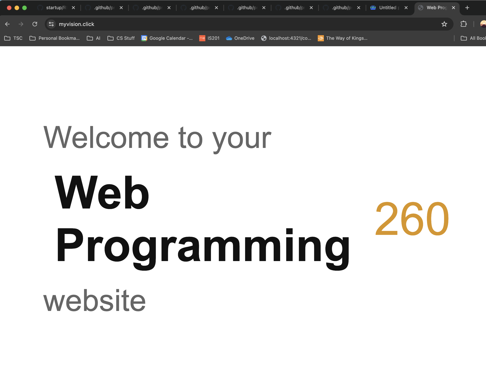

# Notes

<div style="display: flex; flex-direction: row; items-align: center;">
    <a href="#git">Git</a>
    <a href="#aws">AWS</a>
    <a href="#assignments-to-turn-in">Assignments to Turn In</a> *
</div>


## Git

### Merging Commit Conflicts
Resolving commit conflicts was not straight forward. Run ```git pull --rebase=false``` to pull the changes and review the merge. 


## AWS

### EC2 Instance

#### Create an instance

1. Open the AWS console in your browser and log in.

2. Navigate to the EC2 service.

3. Change your region (top right corner) to US East (N. Virginia) - us-east-1. Changing your region to N. Virginia will make it so that your server is located there. ⚠ This is crucial because the Amazon Machine Image (AMI) you will use is only available in N. Virginia.

4. Select the option to Launch instance.

5. Give your instance a meaningful name. Perhaps use a convention such as [owner]-[purpose]-[version].

6. We have created an Amazon Machine Image (AMI) for you to use as the base for your server. It has Ubuntu, Node.js, NVM, Caddy Server, and PM2 built right in so that you do not have to install them. Paste this AMI ID (ami-0b009f6c56cdd83ed) into the search box and press enter. Then select the Community AMIs tab. If no matches are found, make sure that your region is set to US East (N. Virginia) - us-east-1 (You can check this by looking in the top right corner of the page).

This should display the information about the class AMI. If the AMI ID matches ami-0b009f6c56cdd83ed select it.

7. Select t3.nano, t3.micro, or t2.micro for the instance type depending on how much power you want, how much you want to spend, or if you qualify for a free usage tier. Since I qualify for a free usage tier I did t2.micro

8. Create a new key pair. Make sure you save the key pair to your development environment. This needs to be safe in a place that is not publicly accessible and that you won't accidentally delete or commit to a GitHub repository. You will need this every time you secure shell (ssh) into this server (production environment). Note that you don't have to create a new key pair every time you launch an instance. You can use one that you created previously so that all of the servers you create can be accessed with the same key file.

9. For the network settings, make sure the auto-assign public IP address is enabled. For the Firewall (security group) select the option to Create security group if this is the first server that you are creating. Allow SSH, HTTP, and HTTPS traffic from anywhere.

10. A security group represents the rules for allowing access to your servers. Security group rules specify both the port that is accessible on your server, and the source IP address that requests are allowed from. Now that i've created a server security group, I can just use that one in the future.

11. If you are using a T3 class server you can take an advantage of the unlimited credit specification. If you are not using at T3 class instance you can ignore this step.

12. Select the option to Launch instance.

It will take a couple minutes for the instance to startup, but once it is marked as running it is close to being ready. Look at the properties for the instance and copy the public IP address.

Open your browser and paste the public IP address for your server in the location bar along with the prefix http://. For example:

http://3.22.63.37
If the server has started up, then you should see the following. Otherwise, wait a little bit and refresh your browser again. If the server is marked as running and it has been longer than 5 minutes, then there is a problem.

#### SSH to Your Server

ssh -i production.pem ubuntu@34.195.116.217

note production.pem is the key pair file

If you can't connect, go to the server instance in AWS Dashboard and select "Connect".

#### Elastic IP Address

Created for this project:
34.195.116.217
http://34.195.116.217

Elastic IP allows you to create a public IP that won't change if you turn your server off and on.

### Route 53 DOMAIN Service

myvision.click
(1 year, does not auto-renew)

registered to my elastic IP address 34.195.116.217


### HTTPS, TLS, Web Certificates

**HTTPS** - The secure version of HTTP is called Secure Hypertext Transport Protocol (HTTPS)
**TLS** - The handshake negotiation (Sometimes called SSL)
**Web Certificate** - A core piece of the handshake is the exchange of a web certificate that identifies the domain name of the server creating the secure connection. The browser will compare the certificate domain name to the one represented in the URL and if they don't match, or the certificate is invalid or out of date, it will display a massive warning.

## Simon

to deploy simon-html deliverable
```
Christopher simon-html ➤➤ ./deployFiles.sh -k <path to pemkey> -h myvision.click -s simon
```

## CSS

### Tailwind

Tailwind doesn't automatically re-build your classes unless you're using a web-framework like next.js or react. While developing, if you want your classes auto-rebuilt you need to run 
```
npx tailwindcss build input.css -o styles.css --watch
```
The '--watch' flag makes the build run continuously

# Assignments to turn in


## Amazon Web Services - EC2

1. Create an EC2 instance using the class AMI (`ami-0b009f6c56cdd83ed`).
1. Assign an elastic IP address (highly suggested).
1. Test that you can see the default class web page from a browser using the server's public IP address.

Submit a URL using your web server's public IP address to the Canvas assignment.

***Submit*** "http://34.195.116.217"


## HTTPS, TLS, and web certificates

Submit a URL for web server's hostname to the Canvas assignment.

***Submit*** "https://myvision.click"




## The Console

Experiment with console commands.

Once you have done this, go over to the assignments page in Canvas and submit the text that results from running `cat other.txt`.

***RESULTS to submit to canvas***
"xxyy"
```
Christopher test ➤➤ cat other.txt
xxyy
Christopher test ➤➤
```

## CodePen

Forked pen for this assignment "https://codepen.io/Christopher-Hatch/pen/BagQpaO"

## HTML Structure Elements

Forked pen for this assignment "https://codepen.io/Christopher-Hatch/pen/ZEdBLQY"

## HTML Input Elements

Forked pen for this assignment "https://codepen.io/Christopher-Hatch/pen/WNqRwzM"

## HTML Media Elements

Forked pen for this assignment "https://codepen.io/Christopher-Hatch/pen/WNqRwzM"

## CSS Flexbox

Forked pen for this assignment "https://codepen.io/Christopher-Hatch/pen/OJeEOoQ"
